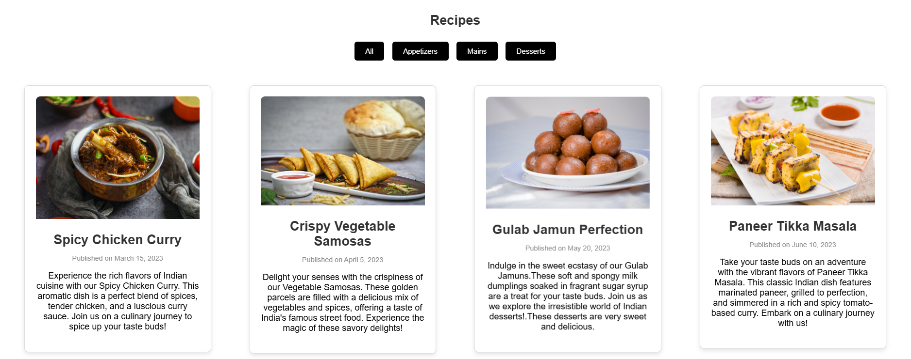

# 🍛 Masala Mingle

Welcome to **Masala Mingle** – your gateway to the vibrant world of **Indian cuisine!** 🇮🇳🍽️ This repository contains the source code for our cooking website, where users can explore **authentic Indian recipes** categorized into **appetizers, mains, and desserts**.

## 🖼 Demo 




## ✨ Features

- 📖 **Recipe Catalog:** Discover a diverse range of Indian dishes, from **spicy chicken curries** to **crispy vegetable samosas** and **delightful gulab jamuns**.
- 🔍 **Category Filters:** Easily filter recipes by categories such as **appetizers, mains, and desserts**.
- ✉️ **Contact Us:** Have questions or feedback? Connect with us through our **contact form**.

## 🚀 Getting Started

### 📥 Clone the Repository
```sh
git clone https://github.com/CharithaAdikari/Masala-Mingle.git
```

### 🛠 Open in Your Preferred Code Editor
- Open the project in **VS Code**, **Sublime Text**, or any code editor of your choice.
- Explore the **HTML, CSS, and JavaScript** files to understand the structure and functionality.
- Customize the content, add more recipes, or enhance the features as per your requirements.

## 🍽️ Usage

- Open `index.html` to view the **main landing page**.
- Navigate to different sections such as the **recipe catalog** and **contact us** page using the navigation links.

## 🤝 Contributing

We welcome contributions! If you have ideas for **new features, improvements, or bug fixes**, feel free to **submit a pull request**.

## 📩 Contact

For any questions or feedback, reach out to us using the **contact form** in the "Contact Us" section.

Happy cooking and happy coding! 🍲👨‍🍳👩‍🍳
